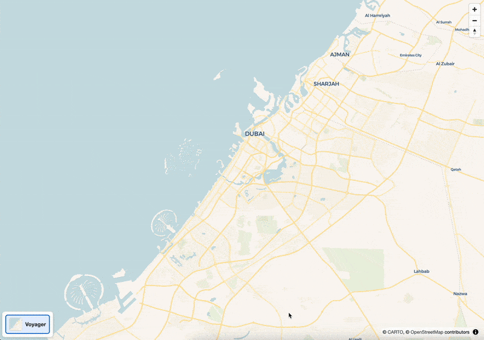
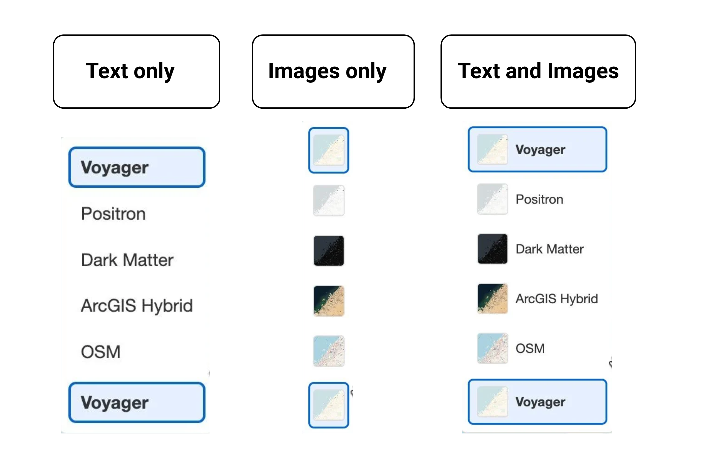

# Map GL Style Switcher

[](https://badge.fury.io/js/map-gl-style-switcher)
[](https://github.com/muimsd/map-gl-style-switcher/actions/workflows/ci.yml)
[](https://opensource.org/licenses/MIT)
[](https://app.netlify.com/projects/map-gl-style-switcher/deploys)

<!-- [](https://codecov.io/gh/muimsd/map-gl-style-switcher) -->

A TypeScript control for switching Mapbox GL / MapLibre GL map styles. Easily add a floating style switcher to your map app, with support for multiple styles, images, dark/light themes, and before/after change callbacks.

**Available as:**

- `StyleSwitcherControl` - Direct IControl implementation for Mapbox/MapLibre GL
- `MapGLStyleSwitcher` - React component for react-map-gl integration
  _Live demo of the style switcher control in action_

**<a href="https://map-gl-style-switcher.netlify.app/" target="_blank">🌐 Live Demo</a>**

## Animated Demo



## Available Styles



## Features

- IControl implementation for Mapbox GL / MapLibre GL
- **React component for react-map-gl integration**
- Floating style switcher in any corner (via map.addControl position)
- Support for multiple map styles with thumbnails
- Expand/collapse on hover with smooth animations
- Dark/light/auto theme support
- RTL text support for Arabic scripts
- Configurable display options (show/hide labels and images)
- Callbacks for before/after style change
- Fully customizable CSS classe's
- TypeScript support
- Accessibility features (ARIA labels, keyboard navigation)
- Comprehensive test coverage

## Install

```sh
# Using npm (recommended)
npm install map-gl-style-switcher

# Using yarn
yarn add map-gl-style-switcher

# Using pnpm
pnpm add map-gl-style-switcher
```

### Basic Map Instance

For React applications where you manage the map instance yourself (e.g., with `useEffect`), use the `useStyleSwitcher` hook:

```tsx
import React, { useEffect, useRef } from 'react';
import * as maplibregl from 'maplibre-gl';
import { StyleSwitcherControl, type StyleItem } from 'map-gl-style-switcher';
// Custom hook
// import { useStyleSwitcher } from 'map-gl-style-switcher/react';
import 'maplibre-gl/dist/maplibre-gl.css';
import 'map-gl-style-switcher/dist/map-gl-style-switcher.css';

const mapStyles: StyleItem[] = [
  {
    id: 'voyager',
    name: 'Voyager',
    image:
      'https://raw.githubusercontent.com/muimsd/map-gl-style-switcher/refs/heads/main/public/voyager.png',
    styleUrl: 'https://basemaps.cartocdn.com/gl/voyager-gl-style/style.json',
    description: 'Voyager style from Carto',
  },
  {
    id: 'positron',
    name: 'Positron',
    image:
      'https://raw.githubusercontent.com/muimsd/map-gl-style-switcher/refs/heads/main/public/positron.png',
    styleUrl: 'https://basemaps.cartocdn.com/gl/positron-gl-style/style.json',
    description: 'Positron style from Carto',
  },
  {
    id: 'dark-matter',
    name: 'Dark Matter',
    image:
      'https://raw.githubusercontent.com/muimsd/map-gl-style-switcher/refs/heads/main/public/dark.png',
    styleUrl: 'https://basemaps.cartocdn.com/gl/dark-matter-gl-style/style.json',
    description: 'Dark style from Carto',
  },
  {
    id: 'arcgis-hybrid',
    name: 'ArcGIS Hybrid',
    image:
      'https://raw.githubusercontent.com/muimsd/map-gl-style-switcher/refs/heads/main/public/arcgis-hybrid.png',
    styleUrl:
      'https://raw.githubusercontent.com/go2garret/maps/main/src/assets/json/arcgis_hybrid.json',
    description: 'Hybrid Satellite style from ESRI',
  },
  {
    id: 'osm',
    name: 'OSM',
    image:
      'https://raw.githubusercontent.com/muimsd/map-gl-style-switcher/refs/heads/main/public/osm.png',
    styleUrl:
      'https://raw.githubusercontent.com/go2garret/maps/main/src/assets/json/openStreetMap.json',
    description: 'OSM style',
  },
];

export default function App() {
  const mapContainer = useRef<HTMLDivElement | null>(null)

  useEffect(() => {
    if (!mapContainer.current) {
      console.error('Map container not found!');
      return;
    }
    const currentStyle = mapStyles[0];
    const map = new maplibregl.Map({
      container: mapContainer.current,
      // Use a simple, reliable style first
      style: currentStyle.styleUrl,
      // Center on Dubai, UAE
      center: [55.2708, 25.2048],
      zoom: 10,
    });

    // Add style switcher control
    const styleSwitcher = new StyleSwitcherControl({
      styles: mapStyles,
      theme: 'auto',
      showLabels: true,
      showImages: true,
      activeStyleId: currentStyle.id,
      onBeforeStyleChange: (from, to) => {
        console.log('Changing style from', from.name, 'to', to.name);
      },
      onAfterStyleChange: (_from, to) => {
        map.setStyle(to.styleUrl);
        console.log('Style changed to', to.name);
      },
    });
    map.addControl(styleSwitcher, 'bottom-left');

    return () => {
      map.remove();
    };
  }, []); // Empty dependency array

  // Add style switcher control to the map
  // useStyleSwitcher(map.current, {
  //   styles,
  //   theme: 'auto',
  //   position: 'top-right',
  //   onAfterStyleChange: (from, to) => {
  //     if (map.current) {
  //       map.current.setStyle(to.styleUrl);
  //     }
  //   },
  // });

  return (
    <div
      ref={mapContainer}
      style={{
        width: '100%',
        height: '500px',
      }}
    />
  );
}

```

## Examples

### React Map GL Example

[View the maplibre example →](examples/maplibre/)

### React Map GL Example

[View the react-map-gl example →](examples/react-map-gl/)

## Configuration Options

```ts
interface StyleSwitcherControlOptions {
  styles: StyleItem[]; // Array of map styles (required)
  activeStyleId?: string; // Currently active style ID (default: first style)
  onBeforeStyleChange?: (from: StyleItem, to: StyleItem) => void; // Callback before style change
  onAfterStyleChange?: (from: StyleItem, to: StyleItem) => void; // Callback after style change
  showLabels?: boolean; // Show style names (default: true)
  showImages?: boolean; // Show style thumbnails (default: true)
  animationDuration?: number; // Animation duration in ms (default: 200)
  maxHeight?: number; // Max height of expanded list (default: 300)
  theme?: 'light' | 'dark' | 'auto'; // UI theme (default: 'light')
  classNames?: Partial<StyleSwitcherClassNames>; // Custom CSS classes
  rtl?: boolean; // Enable RTL layout (default: false)
}

interface StyleItem {
  id: string; // Unique identifier
  name: string; // Display name
  image: string; // Thumbnail URL or data URI
  styleUrl: string; // MapLibre/Mapbox style URL
  description?: string; // Optional tooltip text
}

interface StyleSwitcherClassNames {
  container: string; // Main container class
  list: string; // Expanded list container class
  item: string; // Individual style item class
  itemSelected: string; // Selected style item class
  itemHideLabel: string; // Hide label utility class
  dark: string; // Dark theme class
  light: string; // Light theme class
}
```

_Example of different map styles that can be used with the style switcher_

### Option Details

- **`activeStyleId`**: Controls both the initially selected style and what's displayed in the collapsed state
- **`showLabels`** & **`showImages`**: At least one must be `true`
- **`theme`**:
  - `'light'`: Light color scheme
  - `'dark'`: Dark color scheme
  - `'auto'`: Auto-detect from system preference
- **`rtl`**: Enables right-to-left layout for Arabic/Hebrew interfaces

## Customizing CSS Classes

You can override all CSS classes used by the style switcher control using the `classNames` option:

```ts
import { StyleSwitcherControl } from 'map-gl-style-switcher';

const styleSwitcher = new StyleSwitcherControl({
  styles,
  showLabels: true,
  showImages: true,
  classNames: {
    container: 'my-style-switcher',
    list: 'my-style-list',
    item: 'my-style-item',
    itemSelected: 'my-style-item-selected',
    itemHideLabel: 'my-style-item-hide-label',
    dark: 'my-style-dark',
    light: 'my-style-light',
  },
});
```

See the default class names in the `StyleSwitcherControl` source for all available keys.

## Contributing

We welcome contributions! Please feel free to submit a Pull Request. For major changes, please open an issue first to discuss what you would like to change.

### Development Setup

1. **Clone the repository**

   ```sh
   git clone https://github.com/muimsd/map-gl-style-switcher
   cd map-gl-style-switcher
   ```

2. **Install dependencies**

   ```sh
   npm install
   ```

3. **Start development server**

   ```sh
   npm run dev
   ```

4. **Make your changes**
   - Follow TypeScript best practices
   - Maintain backward compatibility when possible
   - Add tests for new features

5. **Test your changes**

   ```sh
   npm run validate  # Runs type-check, lint, format-check, and tests
   ```

6. **Submit a pull request**

### Guidelines

- Use npm for dependency management
- Follow TypeScript best practices
- Maintain backward compatibility when possible
- Add tests for new features
- Update documentation as needed
- Follow the existing code style
- Ensure all checks pass: `npm run validate`

## License

MIT License - see [LICENSE](LICENSE) file for details.

---

Made with ❤️ for the MapLibre GL and Mapbox GL community
